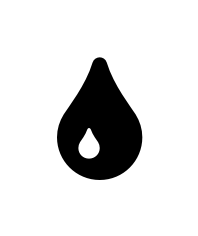

# Algorithme_snake
L’objectif est d’utiliser l’algorithme des snakes comme une alternative plus pertinente au calcul du gradient d’une image pour le d´etourage d’un objet.

# Explication de l'algorithme

On dispose d'une image dont on souhaite contourer l'objet. Ici on prend l'exemple d'une goutte : 

