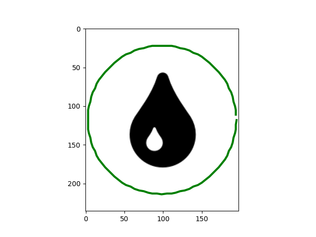
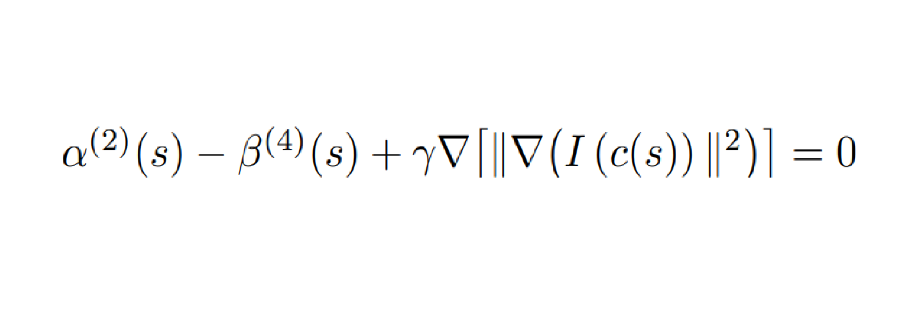
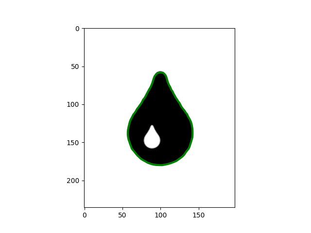
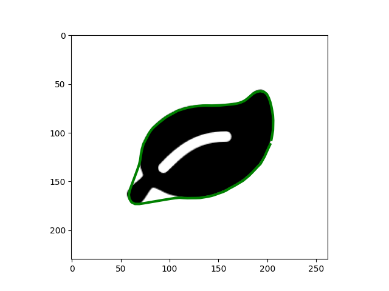

# Algorithme snake
L’objectif est d’utiliser l’algorithme des snakes comme une alternative plus pertinente au calcul du gradient d’une image pour le détourage d’un objet.

# Explication de l'algorithme

On dispose d'une image dont on souhaite contourer l'objet. Ici, on prend l'exemple d'une goutte :

On définit ainsi notre snake \( c \) comme une liste contenant les coordonnées de tous les points du contour :
c(s) = | x(s) |
       | y(s) |,  s ∈ [0, 1]

La courbe \( c \) est donc une courbe lisse et fermée et on l'initialise de sorte que se soit un cercle. Cette courbe prend en paramètre un réel entre 0 et 1 (abscisse curviligne). Étant fermée, on a évidemment \( c(0) = c(1) \).

On réalise deux hypothèses sur \( c \) :
- \( c \) est une courbe lisse
- \( c \) se place sur les contours de la forme

On obtient apres l'initialisation la figure suivante :

Maintenant nous devons resoudre l'equation suivante ( voir pourquoi dans le compte rendu ) : 

C’est l'équation à résoudre de sorte que ce soit le contour qui minimise l'energie globale du snake. Cependant, cette équation différentielle est difficile à résoudre à cause du dernier terme. C’est pour cela qu’on a implémenté dans le schéma itératif de convergence. Les parametres utilisés sont : alpha = 1, beta = 0,5 et gamma = 15 on obtient apres 16 000 itérations la figure suivante :

On observe que la figure a bien été détourer. On notera qu'il faut jouer sur les parametres pour obtenir les résultats et qu'il n'y a pas de formule prédéfinie pour les choisir.

# Autre figure :

